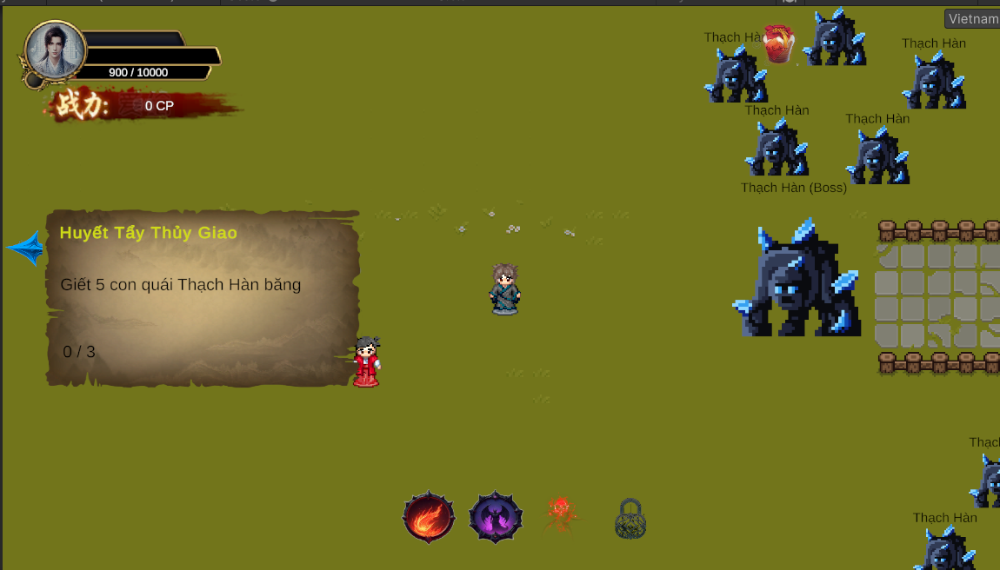

<div align="center">

[](https://www.linkedin.com/in/qu%E1%BB%91c-th%E1%BA%AFng-tr%C6%B0%C6%A1ng-b%E1%BB%93-7362982b5?utm_source=share&utm_campaign=share_via&utm_content=profile&utm_medium=ios_app)

</div>


## About NineHeavensRPG (https://youtu.be/nTTStcqcWe0?si=HSkZo2H1WxuVzall)

**Nine Heavens Saga** is a **2D Xianxia RPG** where players embark on an epic cultivation journey, striving to ascend through the mystical realms of the **Nine Heavens Continent (九天大陆)**. Inspired by Chinese mythology, the game features deep character progression, martial arts techniques, and a rich storyline filled with legendary battles and celestial adventures.

**Preview**

https://youtu.be/nTTStcqcWe0?si=HSkZo2H1WxuVzall

**Storyline** 

In the distant past, the Nine Heavens Continent was once ruled by celestial beings, where mortals, demons, and deities coexisted. However, a great calamity known as the Void Cataclysm shattered the balance, scattering the divine relics and sealing away the ancient deities. Now, as a young cultivator with a mysterious past, you awaken in a remote sect with only fragmented memories. The path ahead is treacherous, filled with rival sects, forgotten legacies, and divine trials. Will you rise above the heavens, uncover the secrets of the past, and forge your destiny?

## Key Features

### **Add early game introduction**
Betrayed by your fiancée and cast into the abyss, you awaken amidst the darkness of a bottomless ravine. As pain courses through your body, fragments of the past resurface—the once blissful days of love, trust, and shared dreams now reduced to bitter memories. Yet, in the depths of despair, a new fate awaits. Will you succumb to resentment, rise anew with unwavering resolve, or tread a path beyond mortal understanding? Your journey begins from the ruins of your former self, where only the strongest can defy destiny.


### **Dialogue System**
Engage in deep, branching dialogues with NPCs that shape the world around you. The choices you make influence relationships, alliances, and even the fate of entire sects. Whether negotiating with rival cultivators or uncovering lost scrolls, your words carry power.


### **Inventory Interface**
Manage your cultivation resources, ancient artifacts, and rare elixirs in an intuitive inventory system. From spirit swords to forbidden scrolls, every item has a purpose in your journey to immortality.


### **Quest Board**
Accept missions from sect elders, bounty hunters, or wandering immortals. Whether hunting demonic beasts, retrieving lost relics, or uncovering ancient conspiracies, each quest brings you closer to ascension.


## 🚀 Getting Started

### Prerequisites
- Unity 6 (6000.0.33f1)
- .NET SDK

### Installation
1. Clone the repository:
   ```sh
   git clone https://github.com/jeffreys38/NineHeavensRPG.git
   ```
2. Open the project in Unity.

### Important Notes
1. First startup may take a few minutes to download and install dependencies

## 🛠 Tech Stack
- **Engine:** Unity (C#)
- **Data Management:** Addressables, ScriptableObjects, JSON
- **Tools:** DOTween

## 💡 Contributing
We welcome contributions! Please follow the [contribution guidelines](./docs/CONTRIBUTING.md) before submitting a pull request.
